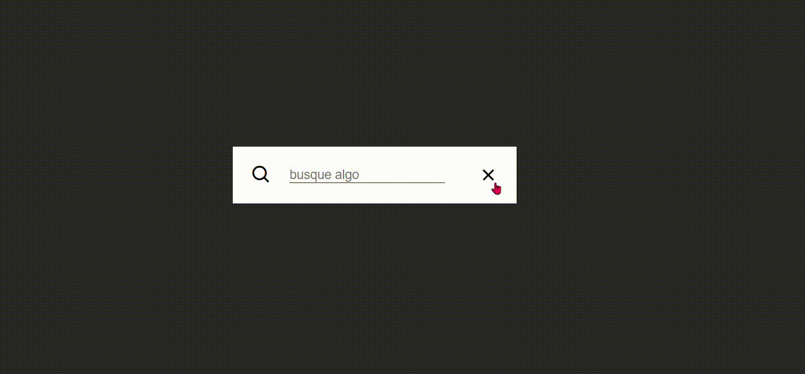

<div align="center" id="top">   

  &#xa0;



</div>

<h1 align="center">Barra de Busca</h1>

<div style="place-content:center; display:flex; gap:20px;">
  
  
  
</div>

<h4 align="center"> 
	🚧  Barra de Busca🚀 concluída...  🚧
</h4> 

<hr>

<p align="center">
  <a href="#coffee-about">Sobre</a> &#xa0; | &#xa0; 
  <a href="#rocket-technologies">Tecnologias</a> &#xa0; | &#xa0;
  <a href="#white_check_mark-requirements">Requirements</a> &#xa0; | &#xa0;
  <a href="#checkered_flag-starting">Starting</a> &#xa0; | &#xa0;
  <a href="#memo-license">License</a> &#xa0; | &#xa0;
  <a href="https://github.com/{{YOUR_GITHUB_USERNAME}}" target="_blank">Author</a>
</p>

<br>

## :coffee: Sobre ##

Este projeto tem como objetivo criar uma barra de navegação interativa utilizando HTML, CSS e JavaScript. A barra de navegação inclui funcionalidades de abrir e fechar, tornando-se um excelente exemplo prático para compreensão de conceitos fundamentais como Event Listeners (addEventListener), manipulação de classes com o método classList e seleção de elementos com querySelector. Ideal para iniciantes, este projeto oferece uma introdução clara e direta aos principais recursos de interação com o DOM.


## :rocket: Tecnologias ##

|Tecnologias | Uso |
|:--------:| ----- |
||Ambiente de Desenvolvimento Integrado |
||Estrutura do projeto |
|| Estilização do projeto|
| | Animações|
| | Histórico de versão |
|| Armazenamento do projeto |
|**Live Server** | Extensão para reload de página em tempo real |

## :white_check_mark: Requisitos ##

Antes de iniciar:checkered_flag:, Você precisa do [Git](https://git-scm.com).

## :checkered_flag: Começar ##

```bash
# Clone esse projeto
$ git clone https://github.com/ESChr/searchbar-js

```


Feito com :heart: por <a href="https://github.com/ESChrystian" target="_blank">Chrystian de Almeida Silva</a>

&#xa0;

<a href="#top">Voltar para o topo</a>
